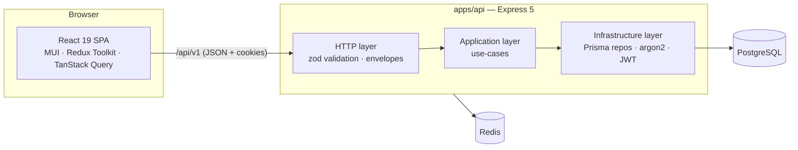

# Architecture

## System overview



## Monorepo

| Package                                        | Role                                                                     |
| ---------------------------------------------- | ------------------------------------------------------------------------ |
| `apps/web`                                     | SPA served by Vite; consumes `@academy/shared` source via alias          |
| `apps/api`                                     | Express 5 API, CommonJS, Clean Architecture per module                   |
| `packages/shared`                              | Zod schemas + contract types; dual-emit (CJS for Node, ESM for bundlers) |
| `packages/tsconfig` / `packages/eslint-config` | Shared strict configs                                                    |

## API layering (per feature module)

```
modules/<feature>/
  domain/           pure invariants (grows with M2+)
  application/      use-cases + repository/service PORTS (interfaces)
  infrastructure/   Prisma/Redis/crypto ADAPTERS implementing the ports
  http/             router: zod validation → use-case → envelope
```

Rules:

- **Dependencies point inward.** `application` never imports express or prisma; `http` and `infrastructure` depend on `application`, never the reverse.
- **Composition happens once**, in `src/container.ts` (manual constructor injection — type-safe, no DI framework, the whole graph readable in one file).
- **Errors**: only `AppError` subclasses cross the HTTP boundary intentionally; the terminal middleware maps them to `{ error: { code, message, details?, requestId } }`. Unknown errors become opaque 500s.
- **Transactions** are opened in the application layer (`TransactionManager`); repositories never decide transaction boundaries. Multi-step repo operations that must be atomic (e.g. refresh-token rotation) expose a single aggregate method.

## Authentication design

- **Access token**: HS256 JWT, 15 min TTL, held in web app memory only (never storage).
- **Refresh token**: 48-byte opaque token, stored as SHA-256 hash, delivered via `httpOnly` + `SameSite=Strict` cookie scoped to `/api/v1/auth`.
- **Rotation families**: every login starts a family; each refresh creates a successor row and stamps the old row. Presenting an already-rotated token **outside** a 30 s grace window is treated as theft → the whole family is revoked. **Inside** the grace window (two tabs racing) a sibling token is issued instead.
- **CSRF**: double-submit — a non-httpOnly `academy_csrf` cookie must be echoed in `X-CSRF-Token` on refresh/logout; compared with a timing-safe equality check.
- **Password hashing**: argon2id (OWASP parameters). Unknown-email logins verify against a dummy hash so timing does not reveal account existence.
- **Rate limiting**: fixed-window Redis store; strict limits on `/auth/*` (30 per 15 min), a general API limit elsewhere.

## Frontend architecture

- **State split**: Redux Toolkit owns client state (session, UI preferences); TanStack Query owns server state (caching, retries). No server data is duplicated in Redux beyond the session snapshot.
- **Silent refresh**: the API client retries a 401 exactly once after a single-flight `/auth/refresh`; `SessionBootstrap` restores the session on first load, so protected routes never flash a redirect for a logged-in user.
- **Theming**: light/dark/system with the preference persisted via a Redux listener middleware.
- **i18n**: `i18next` with typed message catalogs (`ta` must satisfy `Messages` = shape of `en`, so missing keys fail typecheck).
- **Error handling**: a provider-independent root error boundary (no MUI/i18n/store dependencies — any of those could be the thing that crashed).

## Decisions & trade-offs (M1)

| Decision                               | Rationale                                                                                                                                         |
| -------------------------------------- | ------------------------------------------------------------------------------------------------------------------------------------------------- |
| Express 5 + CommonJS                   | User choice; CJS keeps Jest/ts-jest friction-free. ESM-only deps are avoided or hand-rolled (Redis rate-limit store).                             |
| Jest (api) / Vitest (web)              | The spec lists Jest + RTL; RTL runs on Vitest natively in a Vite app — same assertions, no ESM/transform hacks. Jest stays where it is idiomatic. |
| Opaque refresh tokens (not JWT)        | Server-side revocation and reuse detection are hard requirements; opaque + hash gives both cheaply.                                               |
| Offset pagination for admin users list | Admin tables need jump-to-page; cursor pagination arrives with feeds (M7+).                                                                       |
